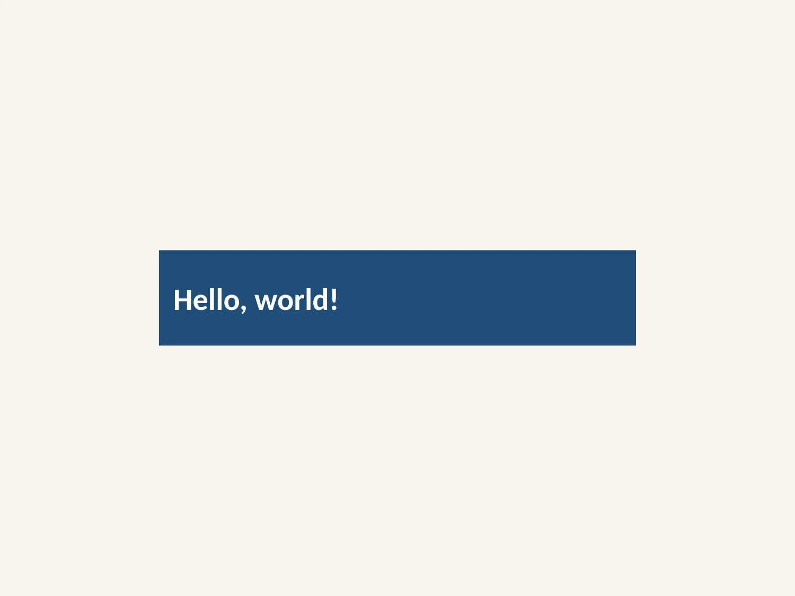
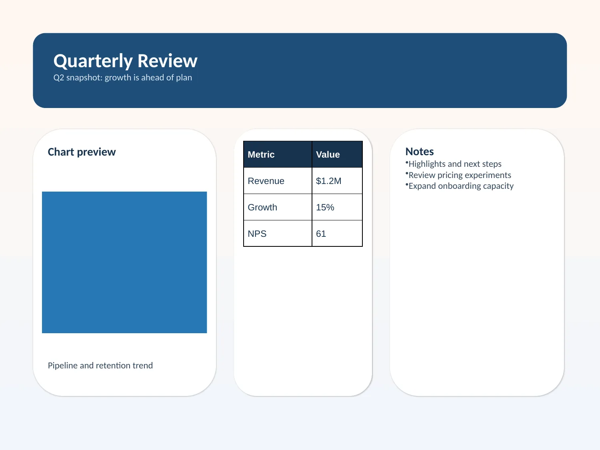

# @pixel/pptx

Deno library for generating PPTX files with a JSX-first layout DSL that lowers
to layout, scene, and OOXML.

## Install

```bash
deno add @pixel/pptx
```

Configure Deno to use `@pixel/pptx` as the JSX import source:

```json
{
  "compilerOptions": {
    "jsx": "react-jsx",
    "jsxImportSource": "@pixel/pptx"
  }
}
```

## Minimal Example

```tsx
/** @jsxImportSource @pixel/pptx */

import { clr, generate, u } from "@pixel/pptx";

const styles = {
  hero: {
    fill: { kind: "solid", color: clr.hex("1F4E79") },
    verticalAlign: "middle",
    inset: u.in(0.18),
  },
  heroText: {
    fontSize: u.font(28),
    fontColor: clr.hex("FFFFFF"),
    bold: true,
  },
};

const deck = (
  <presentation title="Hello deck">
    <slide
      background={{
        kind: "fill",
        fill: { kind: "solid", color: clr.hex("F7F4EE") },
      }}
    >
      <align x="center" y="center" w={u.in(6)} h={u.in(1.2)}>
        <textbox style={styles.hero}>
          <span style={styles.heroText}>Hello, world!</span>
        </textbox>
      </align>
    </slide>
  </presentation>
);

Deno.writeFileSync("hello.pptx", generate(deck));
```

Preview rendered from [`examples/minimal.tsx`](./examples/minimal.tsx).



## Showcase

Full source: [`examples/quarterly-review.tsx`](./examples/quarterly-review.tsx)



## Public API

### Core exports

- `generate(<presentation>...</presentation>)`
- `u.*` for units: `in`, `cm`, `pt`, `emu`, `font`, `pct`
- `clr.hex(...)` for validated OOXML colors
- Inherited layout defaults through `presentation layout={...}` and
  `slide layout={...}`

### Structural JSX tags

- `<presentation>`
- `<slide>`
- `<row>`
- `<column>`
- `<stack>`
- `<align>`

### Content JSX tags

- `<textbox>`
- `<shape preset="...">`
- `<image ... />`
- `<table cols=[...]>`
- `<tr height={...}>`
- `<td>`
- `<chart kind="bar" ... />`

### Text JSX tags

- Raw string and number children create text directly
- `<p>` creates an explicit paragraph
- `gap={...}` on `textbox`, `shape`, and `td` inserts paragraph-block spacing
- `<spacer />` is a flex spacer for `row` and `column`
- Inline tags: `<span>`, `<a href="...">`, `<b>`, `<i>`, `<u>`

### Styling model

- Style props are plain typed objects, not special builder tokens
- `style` accepts either one style object or an array of style objects
- Later style entries win, with nested objects merged structurally
- Backgrounds, fills, lines, shadows, bullets, and image options are plain data

### Placement model

- `basis`, `grow`, `alignSelf`, `aspectRatio`, `w`, and `h` apply directly to
  children inside `<row>` and `<column>`
- `x`, `y`, `w`, and `h` switch a node into parent-relative absolute placement
- Absolute children inside `<row>` and `<column>` do not consume flow space
- `<align>` remains the explicit single-child alignment wrapper
- `presentation layout={...}` and `slide layout={...}` provide inherited
  defaults for slide padding, row/column gap, stack padding, and text gap

## Validation

Run the full local checks before committing:

```bash
deno check mod.ts
deno lint
deno fmt --check
deno test
deno publish --dry-run
```
